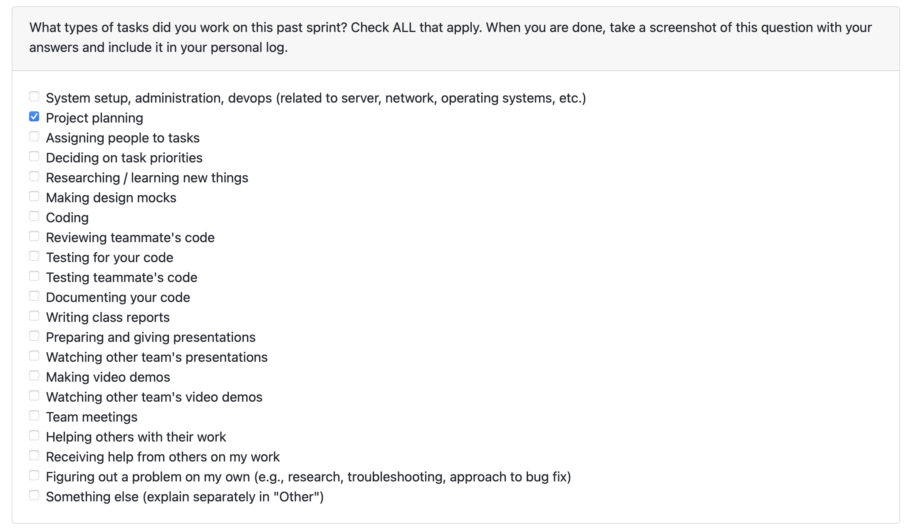

# Individual Log – Abijeet Dhillon Week 3

## Entry – September 15 to September 21

### 1. Type of Tasks Worked On
  

---

### 3. Recap of Weekly Goals
This week consisted of creating our project requirements document and setting up the project repository and Kanban board.

---

### 4. Features Owned in Project Plan
- N/A

---

### 5. Tasks from Project Board Associated with These Features
- N/A

---

### 6. Tasks Completed / In Progress in the Last 2 Weeks
| Task ID | Issue Title | Status       | Notes |
|--------|-------------|-------------|-------|
| N/A    | N/A         | N/A         | N/A   |

---

### 7. Additional Context
This week focused on foundational project setup work. I assisted in the following:
- creating the project requirements document
- initializing the repository
- setting up the Kanban project board on GitHub

Future weeks will include more detailed documentation of tasks as work progresses.

---
