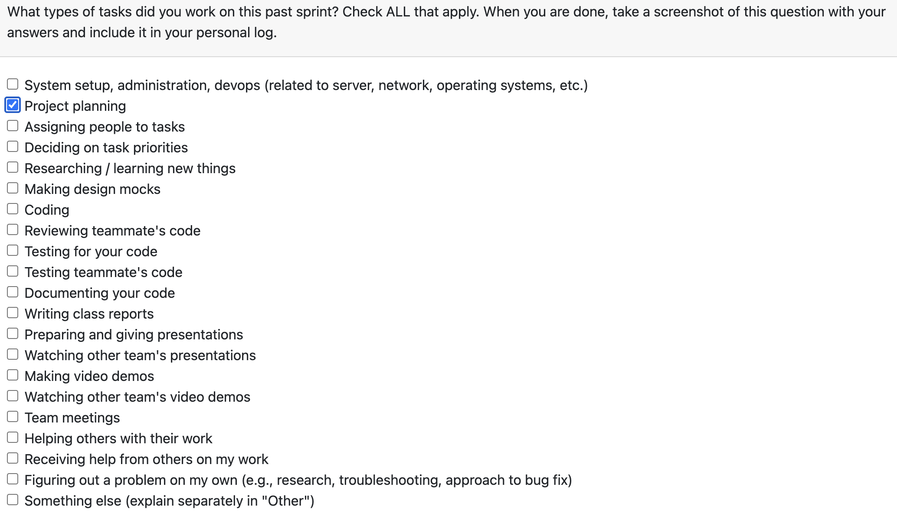

# Individual Log – Abdur Rehman

## Week 3 – September 15 to September 21

### 1. Type of Tasks Worked On
  

---

### 3. Recap of Weekly Goals
This week focused on foundational project requirement work. I assisted in the following:
- outlining the artifact collection features (directory scanning, file filtering, and metadata)
- drafting the artifact analysis requirements (classification and basic statistics)
- reviewing the dashboard and visualization requirements for summary metrics

---

### 4. Features Owned in Project Plan
- N/A

---

### 5. Tasks from Project Board Associated with These Features
- N/A

---

### 6. Tasks Completed / In Progress in the Last 2 Weeks
| Task ID | Issue Title | Status       | Notes |
|--------|-------------|-------------|-------|
| N/A    | N/A         | N/A         | N/A   |

---

### 7. Additional Context
N/A

---