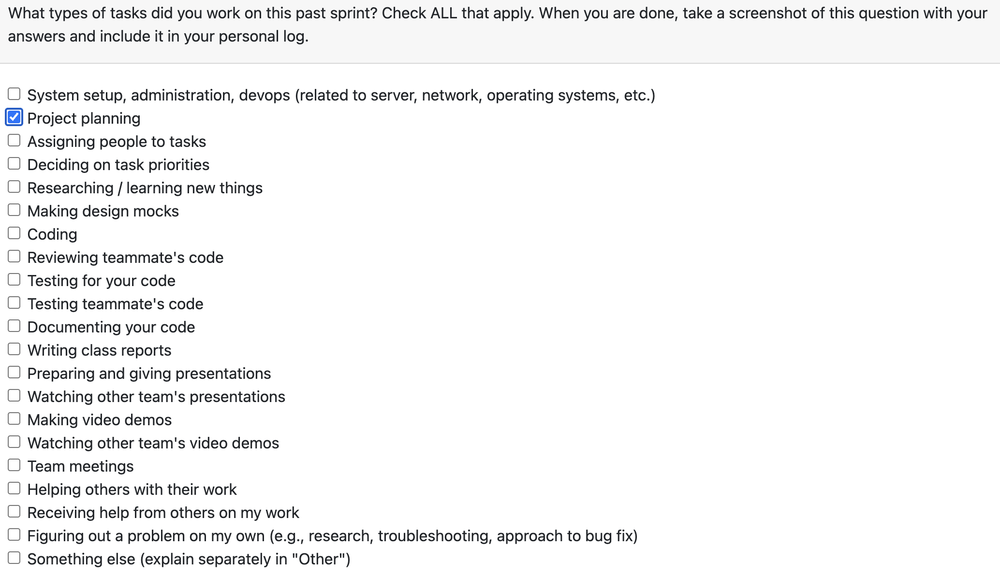

# Individual Log – Abhinav Malik

## Week 3 – September 15 to September 21

### 1. Type of Tasks Worked On
  

---

### 3. Recap of Weekly Goals
This week was mainly focused on early requirement gathering and planning activities. My contributions included:  
- helping define the project requirements and scope  
- reviewing features related to artifact collection and analysis with the team  
- collaborating with group members to finalize the initial requirements document  

---

### 4. Features Owned in Project Plan
- Requirements Documentation  

---

### 5. Tasks from Project Board Associated with These Features
- Project Requirements  

---

### 6. Tasks Completed / In Progress in the Last 2 Weeks
| Task ID | Issue Title          | Status     | Notes |
|---------|----------------------|------------|-------|
| 3       | Project Requirements | Completed  | Drafted and reviewed with team |

---

### 7. Additional Context
N/A
