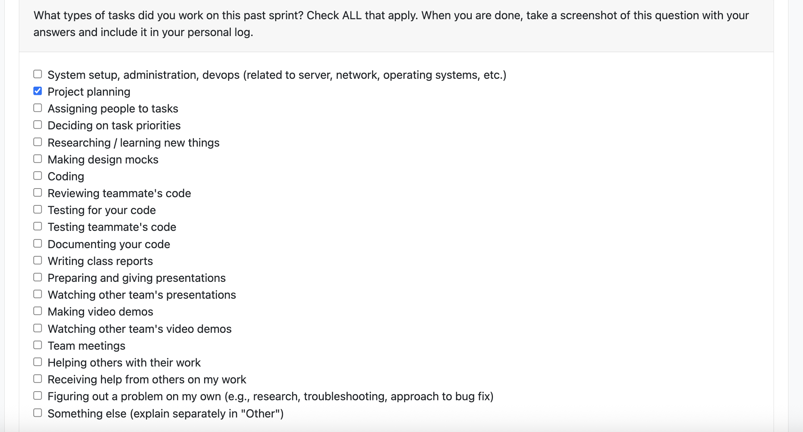

# Individual Log - Kaiden Merchant

## TOC

[Week 3](#week-3)

## Week 3
This section outlines the individual log for week 3

### September 15 - September 21

### Tasks

### Weekly Goals

1. My Features: 
    - Discuss the project outline with the team to understand our user base and project's purpose.
    - Develop / refine our project requirements by discussing with other teams and mapping requirements to use cases.

2. Associated Tasks
    - N/A

3. Completed/In-Progress
    - Completed discussions with the team to understand the project.
    - Completed project requirements document.

