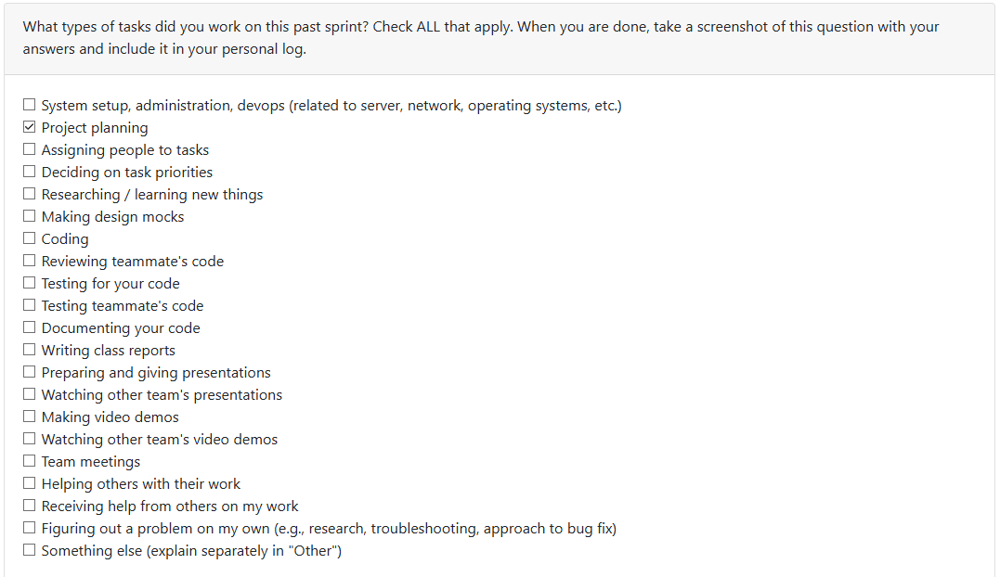

# Personal Log

[Week 3 Personal Logs](#week-3)
[Week 4 Personal Logs](#week-4)

## Week 3
### Date Range 
15th September 2025 - 21st September 2025

### Type of tasks worked on

### Weekly Goals
**My features**:
* The goal was to understand the project theme and contribute to the requirements document
* Created requirements document and drafted functional requirements
* Talked with other groups in class to refine our requirements

**Task from project board**:
* "Project Requirements"

**Completed/In-progress tasks**: 
* "Project Requirements"

---
## Week 4
### Date Range 
22nd September 2025 - 28th September 2025

### Type of tasks worked on

### Weekly Goals
**My features**:
* Collaborate on creating the system architecture diagram
* Collaborate on drafting and completing the project proposal

**Task from project board**:
* 

**Completed/In-progress tasks**: 
* 