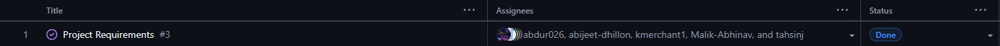

# Team 14 – Capstone Project Team Log 

## Week 3 – September 15 to September 21

### 1. Milestone Goals Recap
- Planned Features for This Milestone:
  - Create project requirements document
  - Set up project repository
  - Set up Kanban project board
- Tasks from Project Board Associated with These Features
  - N/A (Kanban board setup completed this week)

### 2. Burnup Chart
  
N/A (tracking begins later)

### 3. Username → Student Name Mapping
| GitHub Username | Student Name |
|-----------------|-------------|
| abijeet-dhillon | Abijeet Dhillon |
| tahsinj | Tahsin Jawwad |
| kmerchant1 | Kaiden Merchant |
| Malik-Abhinav | Abhinav Malik |
| abdur026 | Abdur Rehman |
| username | name |

### 4. Completed Tasks

### 5. In Progress Tasks
| Task ID | Issue Title | Username | Associated Feature |
|--------|-------------|----------|-------------------|
| N/A    | N/A         | N/A      | N/A               |

### 6. Test Report
N/A

### 7. Additional Context
This week focused on foundational project setup work. The team created the project requirements document, initialized the repository, and set up the Kanban project board on GitHub.  

Future weeks will include more detailed documentation of tasks as work progresses.

---
## Week 4 – September 21 to September 28

### 1. Milestone Goals Recap
- Planned Features for This Milestone:
  - Create system architecture diagram
  - Create project proposal
- Tasks from Project Board Associated with These Features
  - 

### 2. Burnup Chart
  

### 3. Username → Student Name Mapping
| GitHub Username | Student Name |
|-----------------|-------------|
| abijeet-dhillon | Abijeet Dhillon |
| tahsinj | Tahsin Jawwad |
| kmerchant1 | Kaiden Merchant |
| Malik-Abhinav | Abhinav Malik |
| abdur026 | Abdur Rehman |
| username | name |

### 4. Completed Tasks

### 5. In Progress Tasks
| Task ID | Issue Title | Username | Associated Feature |
|--------|-------------|----------|-------------------|
| N/A    | N/A         | N/A      | N/A               |

### 6. Test Report
N/A

### 7. Additional Context
This week focused on project proposal and system architecture. The team created the project proposal document and system architecture diagram.  

---
